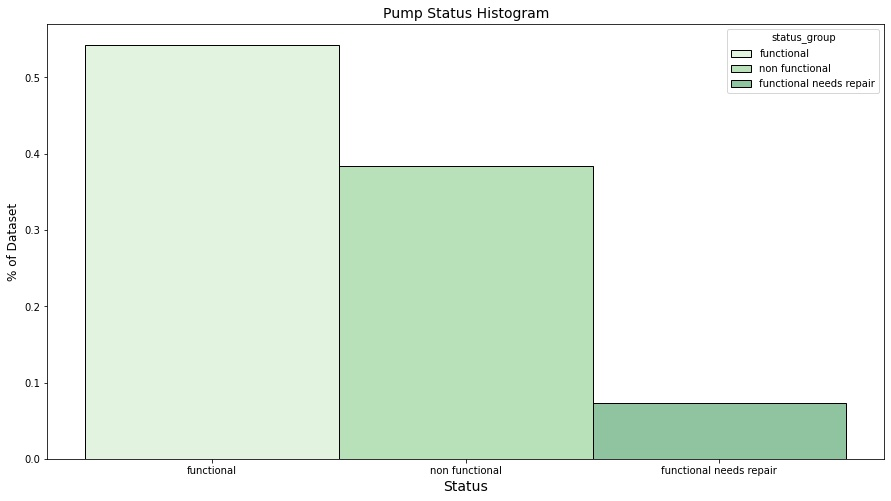
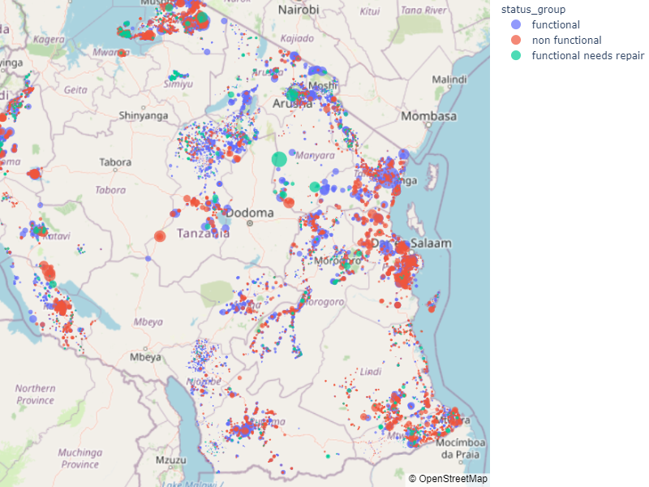
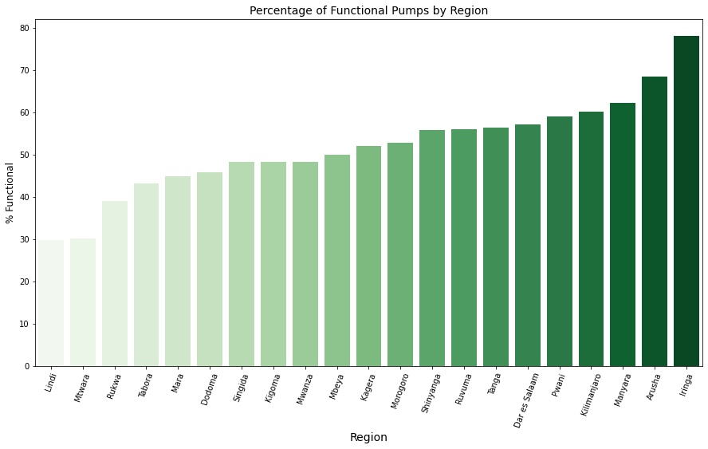
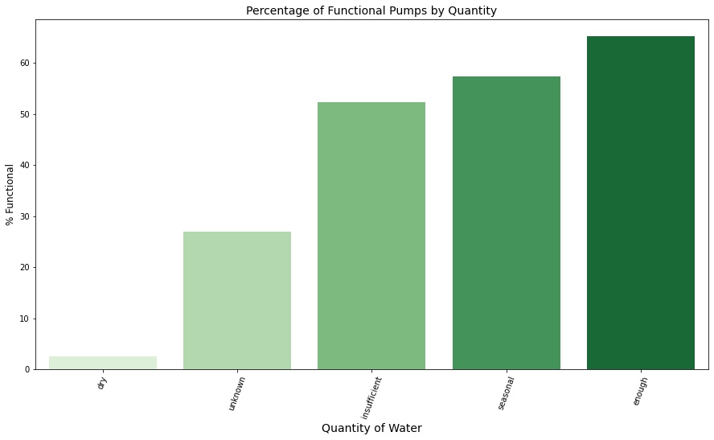
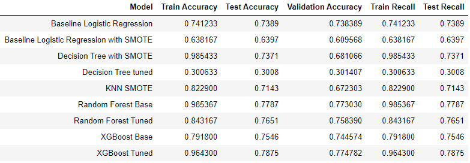
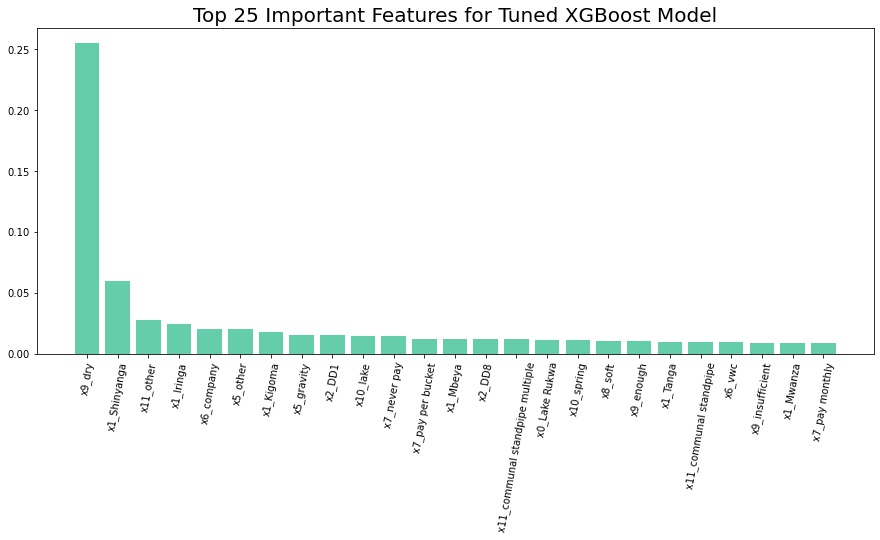

### Set up Instructions

To run these notebooks independently, I have provided the [environment.yml](environment.yml) to clone the new-env environment which contains all dependencies.

If you want to create all the models that appear in the [Submission notebook](https://github.com/aggie2411/Phase_3_Project/blob/main/Notebooks/8.%20Submission.ipynb), notebooks 1-7 would be need to be run first, the models would automatically be stored in the models folder.

# Tanzania Water Pump Classification Project

There are over 56,000 water pumps in Tanzania and the challenge is to create a model that can accurately classify them into the one of the following:

- Functional
- Non Functional
- Functional needs repair

Why?
- Save on money, time and labor.
- Ensure potable water is being provided to as many communities as possible

It would be much better if the Tanzanian Government was able to focus its time and resources to deliver potable water across all communities in a more efficient manner.
Being able to accurately identify pumps in need of repair or broken pumps would improve efficiency in terms of site visits, labor costs, materials and also be a way of informing communities of where they can find their nearest working pump 

## Data

The data was downloaded directly from the [Driven Data](https://www.drivendata.org/competitions/7/pump-it-up-data-mining-the-water-table/page/23/)

A summary of the features was provided:
- amount_tsh - Total static head (amount water available to waterpoint)
- date_recorded - The date the row was entered
- funder - Who funded the well
- gps_height - Altitude of the well
- installer - Organization that installed the well
- longitude - GPS coordinate
- latitude - GPS coordinate
- wpt_name - Name of the waterpoint if there is one
- num_private -
- basin - Geographic water basin
- subvillage - Geographic location
- region - Geographic location
- region_code - Geographic location (coded)
- district_code - Geographic location (coded)
- lga - Geographic location
- ward - Geographic location
- population - Population around the well
- public_meeting - True/False
- recorded_by - Group entering this row of data
- scheme_management - Who operates the waterpoint
- scheme_name - Who operates the waterpoint
- permit - If the waterpoint is permitted
- construction_year - Year the waterpoint was constructed
- extraction_type - The kind of extraction the waterpoint uses
- extraction_type_group - The kind of extraction the waterpoint uses
- extraction_type_class - The kind of extraction the waterpoint uses
- management - How the waterpoint is managed
- management_group - How the waterpoint is managed
- payment - What the water costs
- payment_type - What the water costs
- water_quality - The quality of the water
- quality_group - The quality of the water
- quantity - The quantity of water
- quantity_group - The quantity of water
- source - The source of the water
- source_type - The source of the water
- source_class - The source of the water
- waterpoint_type - The kind of waterpoint
- waterpoint_type_group - The kind of waterpoint

Each water well is labelled as one of the 3 categories:

- functional - the waterpoint is operational and there are no repairs needed
- functional needs repair - the waterpoint is operational, but needs repairs
- non functional - the waterpoint is not operational

## EDA

It is clear from the histogram that this data set suffers from class imbalance, depending on how the government would want to prioritise repairs, this project could easily have focused on one category over the other in terms of performance and selected the best model for a given class. However as the competition metric used is accuracy, this is the one I will be using.

#### Location matters

It looks like when plotting the status of the pumps on the maps there are some patterns emerging, particularly in the South East. Location is likely to be an important feature any model. In this plot, the bigger the marker size, the bigger the population. An interactive version of this map is found in the notebook link above. 

The above map is confirmed by the chart below. It clearly shows the distribution of functional pumps is not equal, some regions have only 30% of pumps functioning where as the best performing region has > 70%.

That is not the only feature where there seems to be a strong relationship, the quantity of water also plays a role. this could be mis-classification it is unclear. From a realistic stand point, a dry well isn't functioning, but does that also mean the well wouldn't work if water returned. This is slightly ambiguous but could result in many pumps being incorrectly classified as non functioning.

## Modelling

Several algorithms were experimented with:

- Baseline Model - Logisitic Regression
- K-Nearest Neighbours
- Random Forest
- Decision Tree
- XGBoost

## Feature Importance

Checking the feature importance is an important step in the post processing phase, it may highlight some models that have an over reliance on certain features. These features then in turn could warrant further investigation.

## Conclusion & Recommendations

- It is recommended to proceed with the tune XGBoost model, this achieved an accuracy score of 0.7747 on the validation data set.
- The recall values for this model were 85,40,78 for the three categories 'functional', 'functional needs repair' and 'non functional'
- this clearly means some pumps in need of repair will be getting misclassified however since the score is poorest in the minority class of which there is relatively few entries, it is not going to be too damaging in terms of wasted resources / site visits etc.
- The X9_Dry feature needs to be investigated, if a well is dry does this mean it automatically non functional?

 - Use the model in conjunction with EDA to prioritise pumps for repair i.e is the model predicting a pump failure, and if so is this supported by other factors, are other wells in the area dry for example?
 - Attempt to improve recall score for minority class further, use model stacking techniques.
 - A thorough investigation of the missclassified entries, there may be a common reason the model is getting it wrong, if this can be rectified the model performance would improve dramatically.
 - It would be recommended to reintroduce some of the dropped features that had high cardinality, there may be a solution to bin these categories and therefore still make use of the data
 - Expand the parameters in the RandomizedsearchCV in an attempt to improve model performance.
 - Utilise GridsearchCV again in an attempt to optimise performance, it was avoided in this project due to computing power and time constraints
